# SUS Evaluation and Results

### The Study

Ten anonymous participants navigated this repository and completed a [System Usability Scale (SUS)](https://www.google.com/books/edition/Usability_Evaluation_In_Industry/IfUsRmzAqvEC?hl=en&gbpv=0) questionnaire as part of an IRB-exempt study. The [SUS Analysis Toolkit](https://sus.mixality.de/) was used to analyze their responses, allowing for uniform scoring, visualization, and interpretation. The responses organized in a csv can be seen [here](SUS-Drawbridge-Responses.csv).

### SUS Results

The SUS results indicate a Study Score of 68.75, as seen in Figure 4, placing our usability at the 50th percentile; meaning our resource is about or slightly above average in terms of usability. This determination is further supported by the Box and Whisker Plot, which shows that our median score is 70, with a mean slightly below that and a standard deviation of approximately 10 points. Ultimately giving the resource a grade of C, which falls within the upper quartile of an "OK" usability determination. Finally, the conclusiveness score (bottom right, Figure 4) indicates that based on the sample size there is an 80% confidence that the results reflect accurate user sentiment. Though our preliminary assessment of this SUS is low in statistical significance, it provides much needed sample evidence and valuable feedback as to the usability of Drawbridge, which prepares us for a more thorough study for improving Drawbridge.

<figure>
    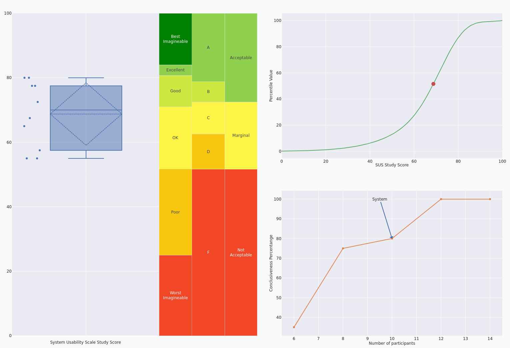
    <figcaption><b>Figure 1</b>: SUS Score Chart 4.</figcaption>
</figure>

## Additional Results

Below are additional charts generated for a comprehensive analysis of the SUS results.

### Response Pie Charts

---

<figure>
    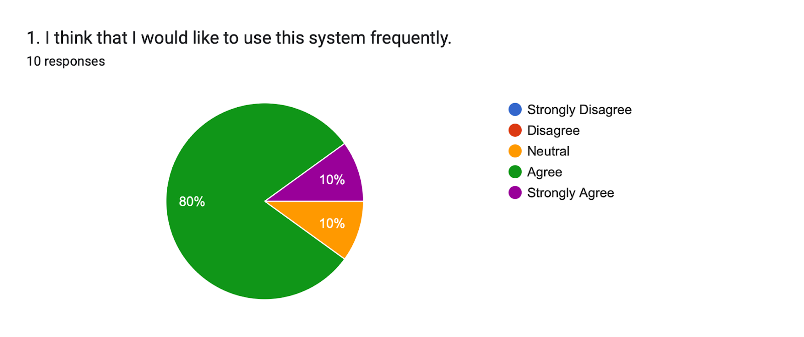
</figure>

<figure>
    
</figure>
<figure>
    
</figure>
<figure>
    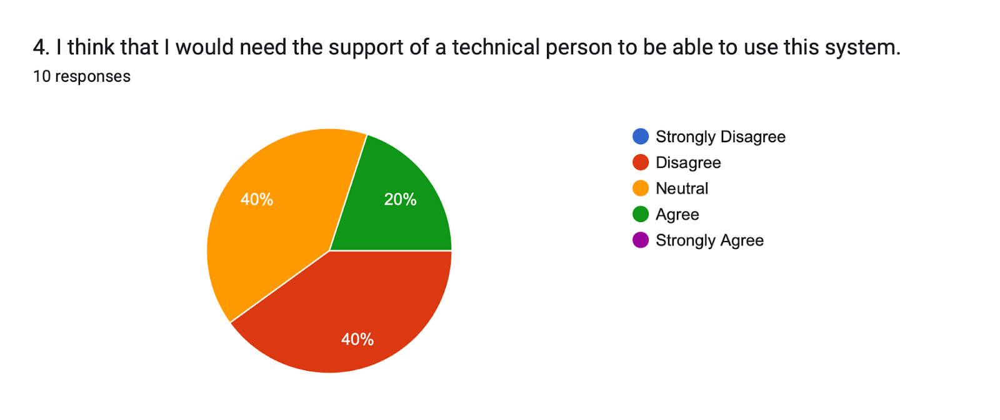
</figure>
<figure>
    
</figure>
<figure>
    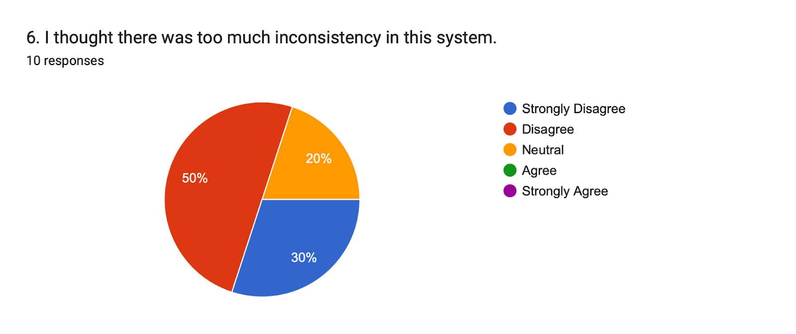
</figure>
<figure>
    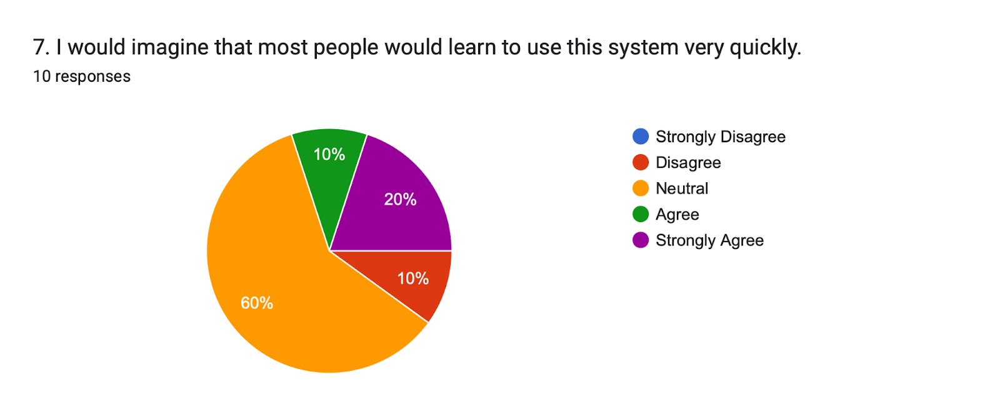
</figure>
<figure>
    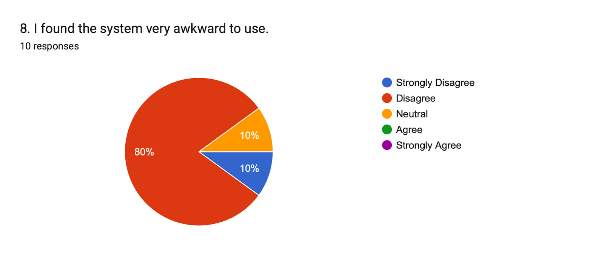
</figure>
<figure>
    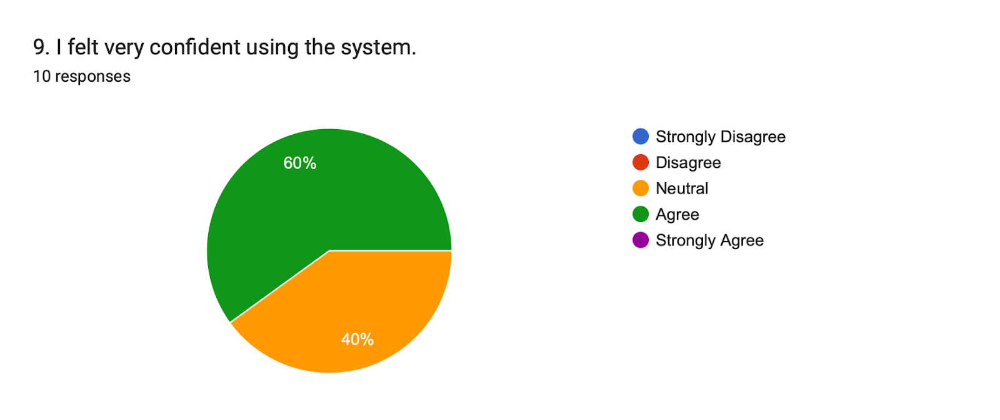
</figure>
<figure>
    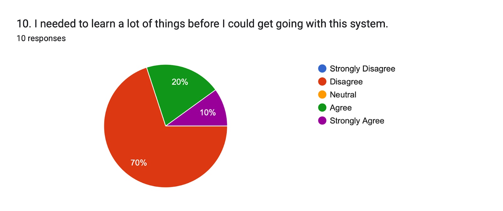
</figure>

### SUS Scores

---

<figure>
    
</figure>
<figure>
    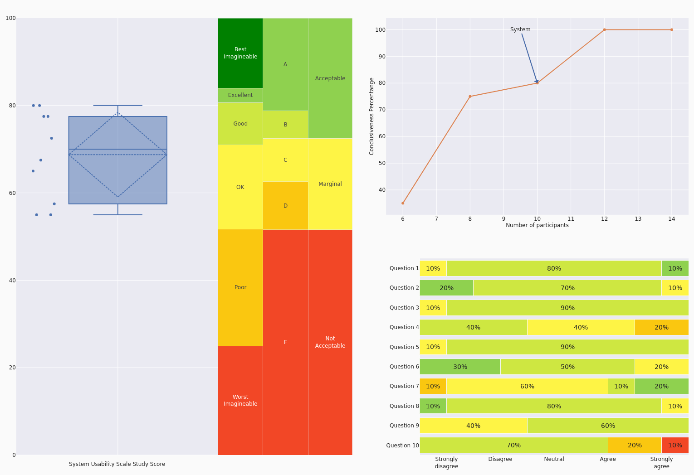
</figure>
<figure>
    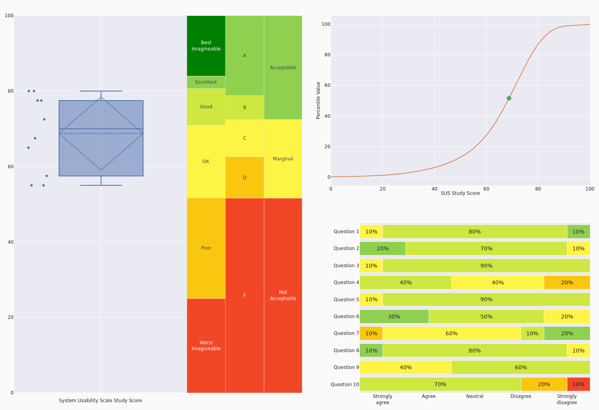
</figure>

### Interpretation

---

<figure>
    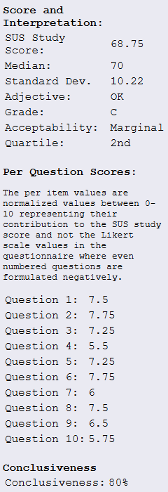
</figure>
