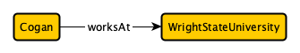

## **Knowledge Graph** -- Reminder
A `Knowledge Graph` (KG) is a `Directed, Weighted Labeled Graph`, where `Entities (Nodes)` are connected by `Relationships (Edges)`.
* `Entities (Nodes)` represent real-world entities (such as people, locations, or concepts).
* `Edges` represent relationships between those entities.
  
A databases’ relationships, and restrictions are all visually represented in a schema diagram. 




### TTl - Turse RDF (Resource Description Framework) Triple Language

* Represents RDF Data in plain triple format:
    * Subject Predicate Object - Cogan worksAt WrightStateUniversity ( mapping of triples from above example)
* A ttl file would be what we get as output from the _rdflif-starter_ code
* Example ttl file:
    ```python
    edu-r:Media.100X_Data_Science_Projects_in_Python_for_Beginners a edu-ont:Article,
        edu-ont:Data_Science_Challenge,
        edu-ont:Data_Science_Project,
        edu-ont:Journal,
        edu-ont:Media ;
    edu-ont:coversTopic edu-r:Topic.Coding,
        edu-r:Topic.Python ;
    edu-ont:hasAuthor edu-r:Author.Aman_Kharwal ;
    edu-ont:hasMediaSourceLink "https://python.plainenglish.io/85-data-science-projects-c03c8750599e"^^xsd:string ;
    edu-ont:hasTitle "100+ Data Science Projects in Python for Beginners"^^xsd:string ;
    edu-ont:supportsLanguage edu-r:Language.English .
    ```
    * Natural Language:
    ```
    "100+ Data Science Projects in Python for Beginners" is classified as an article, data science challenge, data science project, journal, and media resource.
    The resource covers topics related to coding and specifically Python.
    The author of this resource is Aman Kharwal.
    The resource is available online at this link: 100+ Data Science Projects.
    The title of this resource is "100+ Data Science Projects in Python for Beginners".
    The resource is written in English.

    ```
##### Note: RDF :Standard Language for data representation on the Web - will be introduced more later on.

### Assignment

* Can you see where this happens in the _rdflib-starter_ code?
    * Turn the previous result to a ttl graph.

