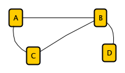
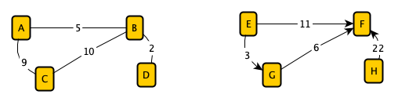
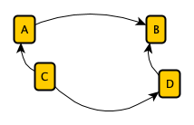

# Graphs

##  Formal Definition 
* A graph `G` is defined as an ordered pair `(V,E)`, where `V` represents a set of Vertices (nodes), and `E` represents a set of Edges (connections between nodes).
* A Vertex (also called a `Node`) is a fundamental unit of a graph, representing an entity or a data point in the graph `G`.
* An Edge `E` is a connection between two vertices, often represented as `(u, v)`, where `u` and `v` are two nodes in the graph.
* A Graph is a non-linear data structure that consists of Vertices (Nodes) and Edges.[1]
* Graphs are non-linear data structures, meaning that there is no strict sequence in which elements are arranged. Instead, elements can be connected in multiple ways to have different paths to get from one vertex to another, forming complex relationships.[1]

## Types of Graphs

### Undirected Graph
An `Undirected Graph` refers to the Graph where the edges `E` have no directional association to vertices `(A,B)`, which means traversing from `(A,B)` is the same as `(B,A)`. This means that if two `Nodes` are connected, movement between them is bidirectional.

### Labeled Graph
A `Labeled Graph` refers to a graph `G` that has arbitrary values (strings or numeric) associated to the set of `Vertices` and set of `Edges`. These labels facilitate in modeling real objects and relationships between nodes. For example, the path you take to travel from your house to campus varies in travel-time pending the turns you might take along the way. 

### Directed Graph

A `Directed Graph (or digraph)` refers to the directionality to which an edge `e` connects to vertices `(A, B)`, which causes a distinction between traversing i.e, if there is an edge from node `A` to node `B`, it means you can move from `A` to `B`, but not necessarily from `B` to `A`.

## **Knowledge Graph**
A `Knowledge Graph` (KG) is a `Directed, Weighted Labeled Graph`, where `Entities (Nodes)` are connected by `Relationships (Edges)`.
* `Entities (Nodes)` represent real-world entities (such as people, locations, or concepts).
* `Edges` represent relationships between those entities.
  
A databases’ relationships, and restrictions are all visually represented in a schema diagram. 

### Assignment

- Make a Graph of Ohio's five major cities ( Dayton, Cincinnati, Columbus, Cle veland, Akron) and inner state routes. 
    -   Is it directed?
    - Can two edges exist for the same node?

## References
[1] [W3 Schools](https://www.w3schools.com/dsa/dsa_theory_graphs.php)  
[2] [Graph Theory by Carnegie Mellon University](https://www.andrew.cmu.edu/course/21-228/lec10.pdf)

