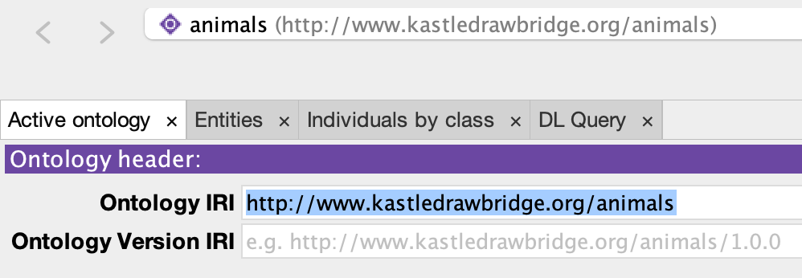
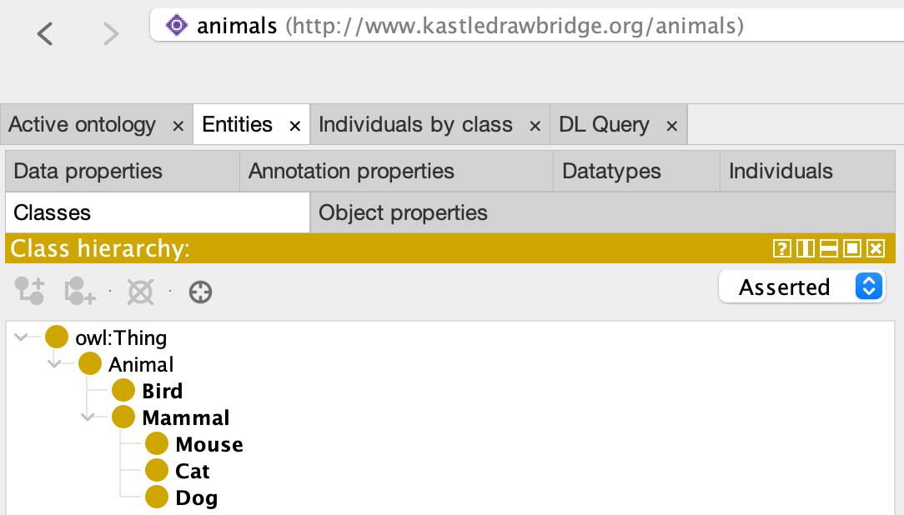
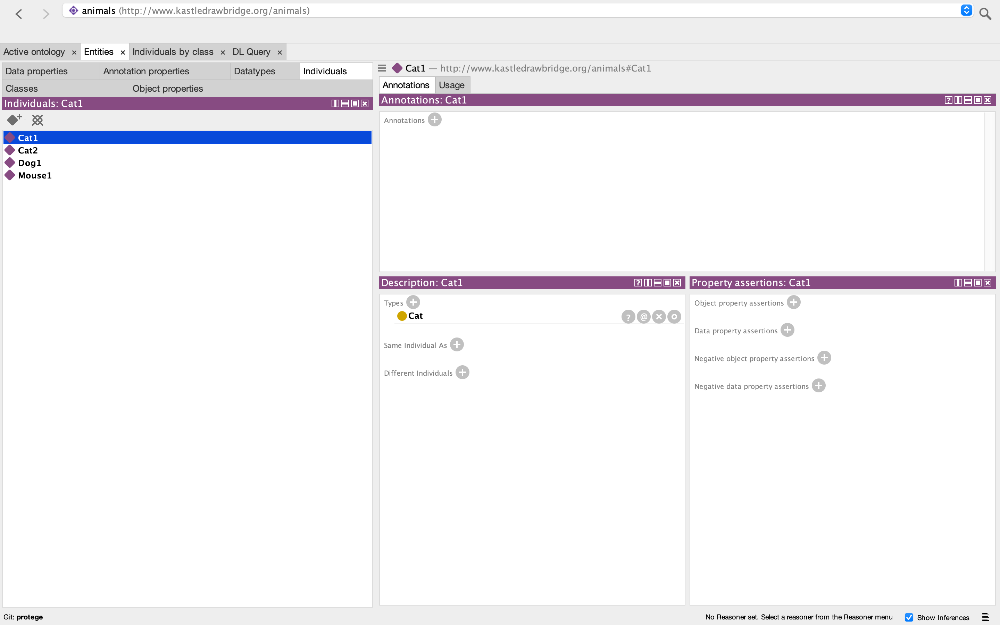
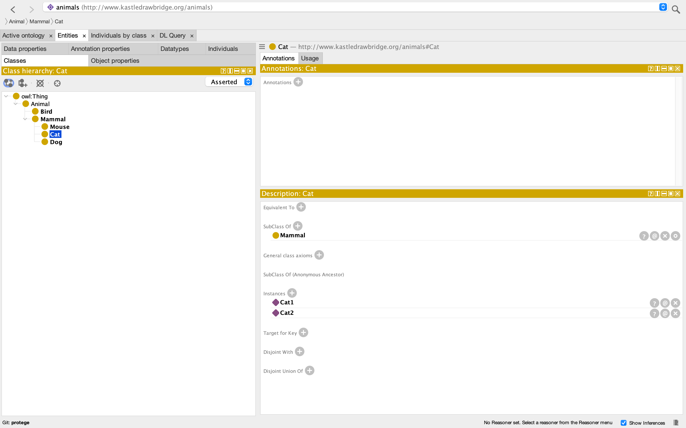
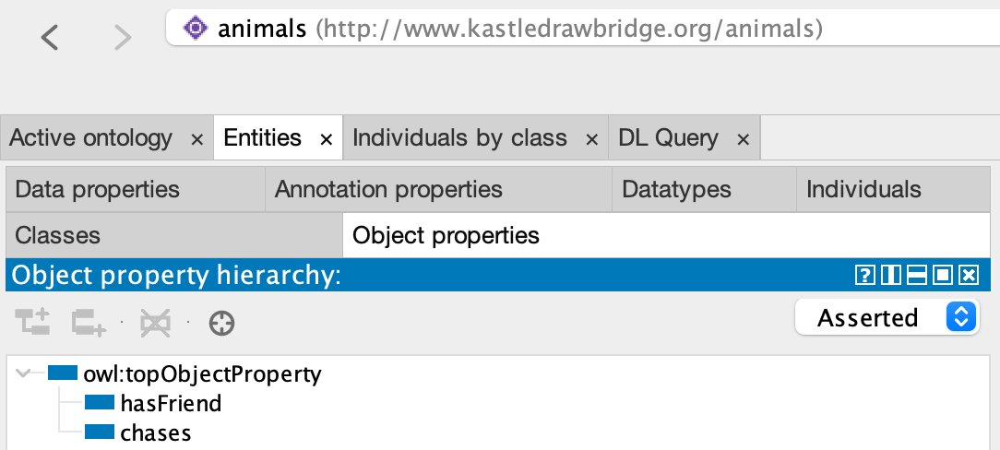
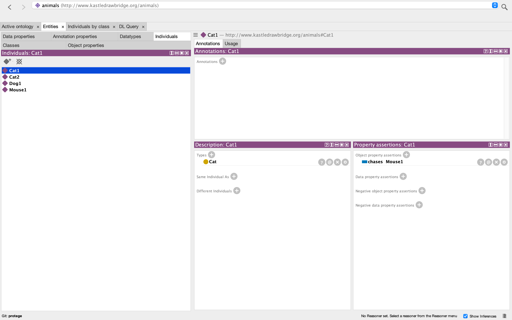
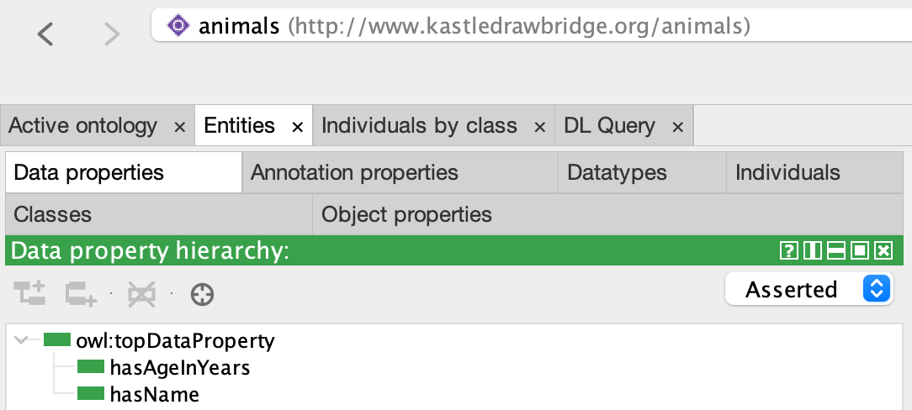
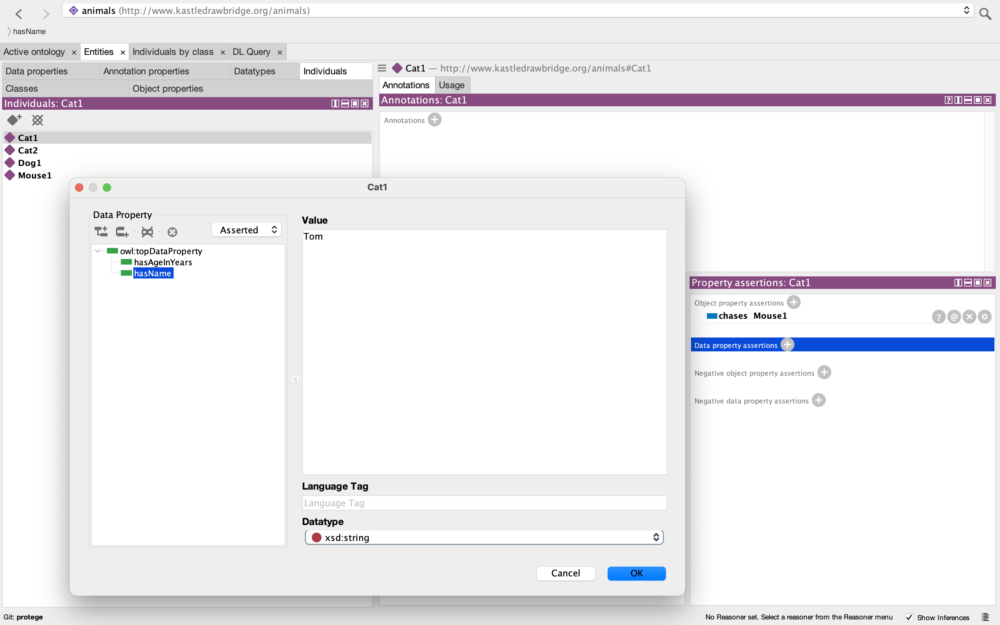
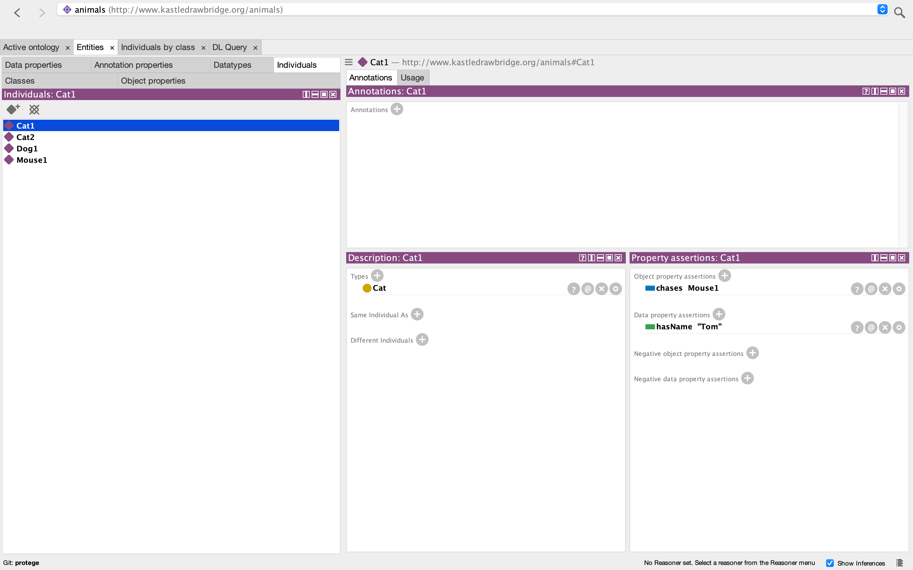
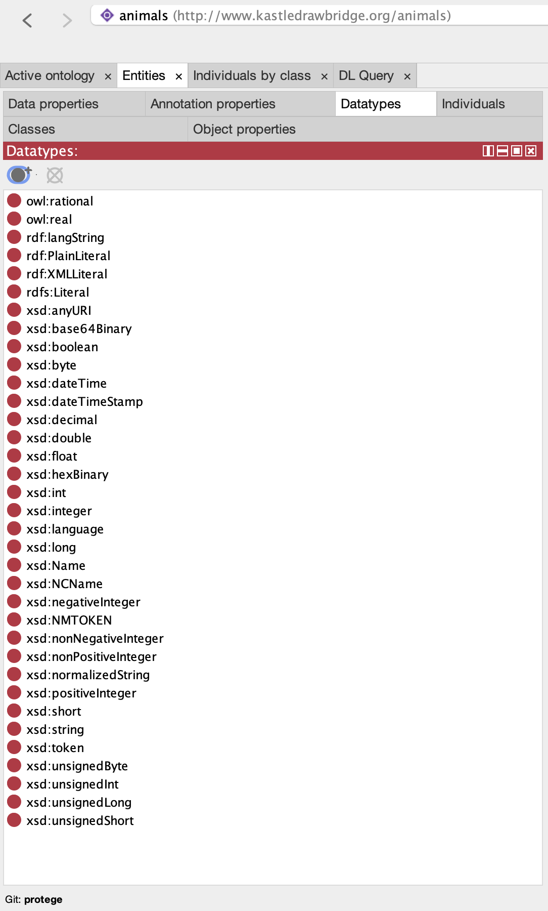

# Protégé

## Prerequisites

- [Knowledge Graph](../01-graphs/graphs.md#directed-graph): A structured representation of entities and relationships using triples ( subject - predicate - object)
- [Axiom](../02-modeling-fundamentals/Axioms.md): A constraint on data that govern the relationships of things.

Protégé is a free, open-source software platform used for creating and managing ontologies. It allows users to define classes (concepts), properties (attributes and relationships), and individuals (instances) along with constraints on data (axioms). By supporting standards like OWL and [RDF](sparql.md), Protégé can easily be added to a pipeline consisting of other tools.

When Protégé is first opened, an `Ontology IRI` can be defined in the `Active ontology` window as shown below to act as a unique ID for the ontology and other contained items:

## Classes

A class represents a general concept or category and can be defined by navigating to the `Classes` tab (`Entities` -> `Classes`), selecting one of the already existing classes, and clicking the `Add subclass` button in the `Class hierarchy` box. Note that every class is a subclass of `owl:Thing`, which is automatically provided by Protégé whenever a new ontology is created. In addition, rather than adding a class as a subclass of another class, one can be added at the same level as another class by selecting it and clicking the `Add sibling class` button instead. If a mistake is made, a class can be deleted by selecting it and clicking the `Delete selected classes` button. In the end, a hierarchy like the one shown below should exist:

### Individuals

An individual (also called an instance) is a specific example of class and can be defined by navigating to the `Individuals` tab (`Entities` -> `Individuals`) and clicking the `Add individual` button in the `Individuals` box. Once it has been created, it can be assigned a class by selecting it and clicking the `+` symbol next to `Types` in the `Description` box. In the end, a layout similar to the one below should exist:

__Note__: that adding a class as a type to an individual will also add that individual as an instance of that class as shown below in the `Description` box of the `Classes` tab:

## Properties

Properties define relationships between classes and individuals. There are two types: object properties and data properties.

### Object Properties

An object property describes a relationship between individuals and can be defined by navigating to the `Object properties` tab (`Entities` -> `Object properties`), selecting one of the already existing object properties, and clicking the `Add sub property` button in the `Object property hierarchy` box. Note that every object property is a subproperty of `owl:topObjectProperty`, which is automatically provided by Protégé whenever a new ontology is created. In addition, rather than adding an object property as a subproperty of another object property, one can be added at the same level as another object property by selecting it and clicking the `Add sibling property` button instead. If a mistake is made, an object property can be deleted by selecting it and clicking the `Delete selected properties` button. In the end, a hierarchy like the one shown below should exist:

Once object properties have been defined, relationships between individuals can be asserted by again navigating to the `Individuals` tab and clicking the `+` symbol next to `Object property assertions` in the `Property assertions` box. Two boxes will appear: one to be filled with an object property name and the other to be filled with an individual name.

### Data Properties

A data property links an individual to a data value (like strings or numbers) and can be defined by navigating to the `Data properties` tab (`Entities` -> `Data properties`), selecting one of the already existing data properties, and clicking the `Add sub property` button in the `Data property hierarchy` box. Note that every data property is a subproperty of `owl:topDataProperty`, which is automatically provided by Protégé whenever a new ontology is created. In addition, rather than adding an data property as a subproperty of another data property, one can be added at the same level as another object property by selecting it and clicking the `Add sibling property` button instead. If a mistake is made, an object property can be deleted by selecting it and clicking the `Delete selected properties` button. In the end, a hierarchy like the one shown below should exist:

Once data properties have been defined, relationships between individuals and data values can be asserted by again navigating to the `Individuals` tab and clicking the `+` symbol next to `Data property assertions` in the `Property assertions` box. Three boxes will appear: one for selecting a data property from the hierarchy, one for specifying the value of the data, and one for specifying the datatype.

## Datatypes

A datatype, as discussed briefly above, specifies the kind of literal value a data property can hold. While new datatypes can be defined by navigating to the `Datatypes` tab (`Entities` -> `Datatypes`) and clicking the `Add datatype` button in the `Datatypes` box, several have been predefined and are ready to use from the start. These predefined datatypes are shown below:

## References

[1] [Protégé](https://protege.stanford.edu/)

# Notes
- should prob talk about axioms somewhere
- maybe what this gives you (ie a ttl file that can be included in materialization)

## Axioms

