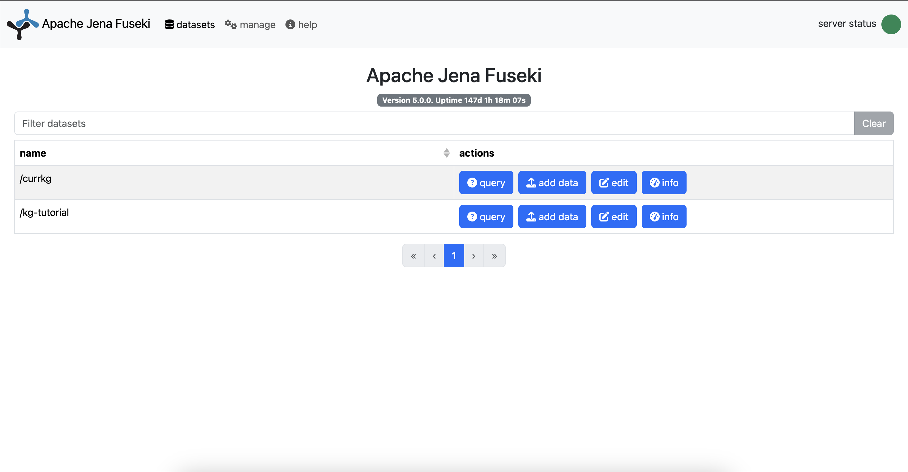
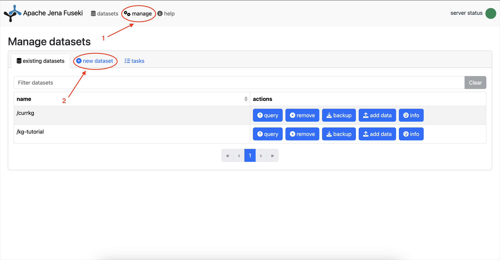
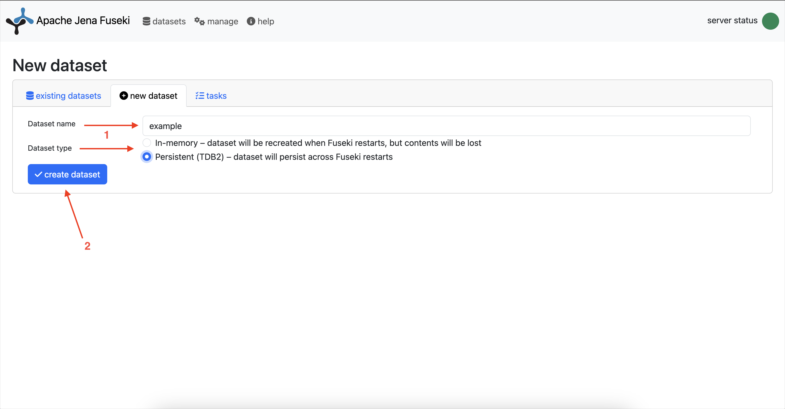
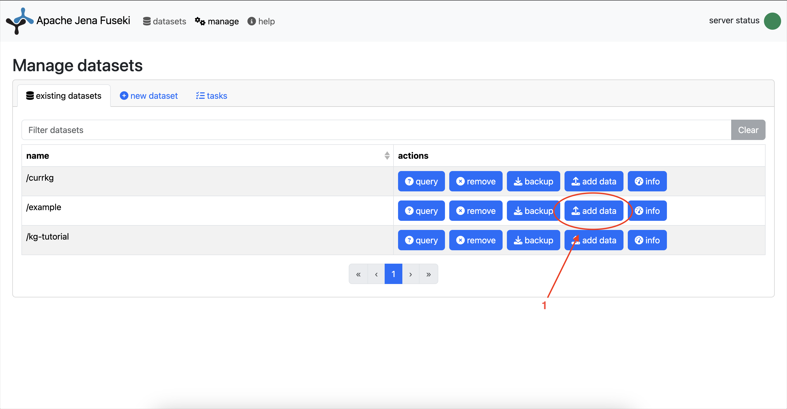
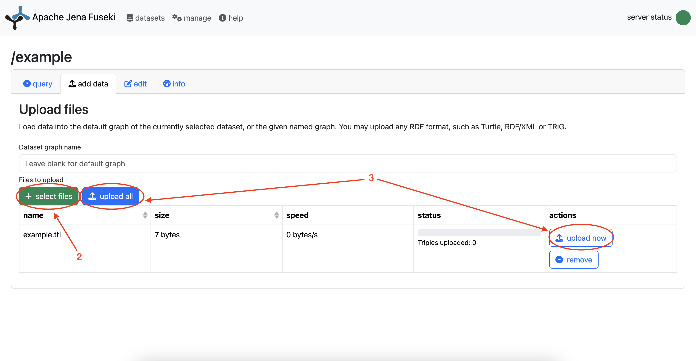
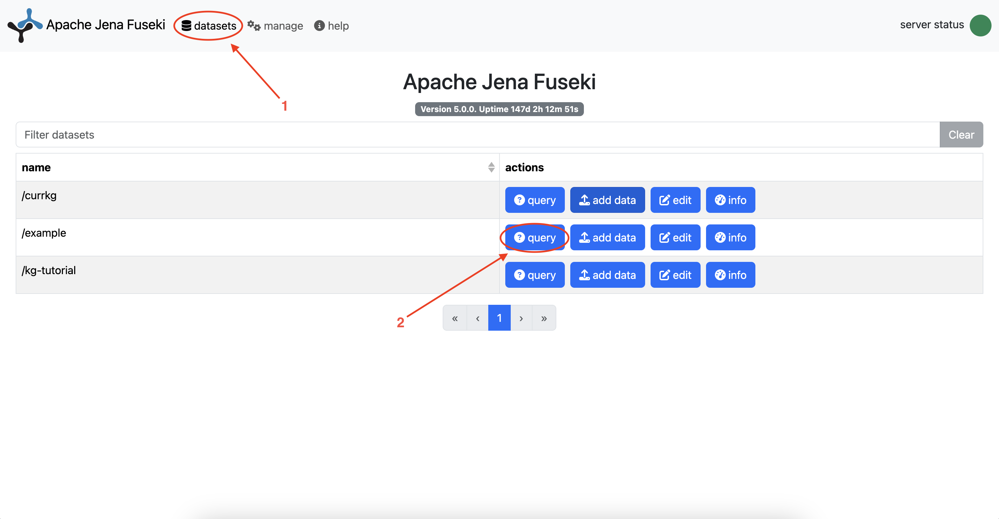

# Querying through a Knowledge Graph

## Objectives

- Learn how to query a knowledge graph using SPARQL
- Explore different ways to query a knowledge graph (locally with RDFLib and via an external SPARQL endpoint using Apache Jena Fuseki)

## Quick Recap

- [Knowledge Graph](../01-graphs/graphs.md#directed-graph): A structured representation of entities and relationships using triples ( subject - predicate - object)
- TTL (.ttl): A Turtle file format – compact and human-readable RDF syntax
- SPARQL: The SQL of Knowledge Graphs. Its Used to query RDF data
- RDFLib: A Python library to create, manipulate, and query RDF graphs.
- Apache Jena Fuseki: A SPARQL endpoint server (triplestore) that allows hosting, querying, and updating RDF data via a web interface or APIs

---

## 1. Sample `.ttl` File (Turtle Format)

```ttl
@prefix edu-ont: <https://edugate.cs.wright.edu/lod/ontology/> .
@prefix edu-r: <https://edugate.cs.wright.edu/lod/resource/> .
@prefix xsd: <http://www.w3.org/2001/XMLSchema#> .

edu-ont:Person edu-ont:assumesRole edu-ont:Author,
        edu-ont:Persona .

edu-r:Category.Learn_X_Teach a edu-ont:Category ;
    edu-ont:asString "Learn & Teach"^^xsd:string .

edu-r:Category.Network_X_Explore a edu-ont:Category ;
    edu-ont:asString "Network & Explore"^^xsd:string .

edu-r:Category.Research_X_Practice a edu-ont:Category ;
    edu-ont:asString "Research & Practice"^^xsd:string .

edu-r:Media.100X_Data_Science_Projects_in_Python_for_Beginners a edu-ont:Article,
        edu-ont:Article_or_Journal,
        edu-ont:Data_Science_Challenge,
        edu-ont:Data_Science_Challenge_X_Project,
        edu-ont:Data_Science_Project,
        edu-ont:Journal,
        edu-ont:Media ;
    edu-ont:coversTopic edu-r:Topic.Coding,
        edu-r:Topic.Python ;
    edu-ont:hasAuthor edu-r:Author.Aman_Kharwal .
```

Save this as `example.ttl`.

---

## 2. Working with RDFLib in Python

Using RDFlib, you can query the knowldge graph directly after creating of a new RDF graph, or load a periously exisitng one with a .ttl file.

### Load and Query Turtle Data

```python
from rdflib import Graph, Namespace

# Create graph object and load TTL
g = Graph()
g.parse("example.ttl", format="turtle")

# Example SPARQL query (include prefix, and all)
test_query = """
PREFIX edu-ont: <https://edugate.cs.wright.edu/lod/ontology/>
PREFIX edu-r: <https://edugate.cs.wright.edu/lod/resource/>

SELECT ?media ?author
WHERE {
  ?media a edu-ont:Media ;
         edu-ont:coversTopic edu-r:Topic.Python ;
         edu-ont:hasAuthor ?author .
}
"""
# Run query
query_result = g.query(test_query)
for row in query_result:
    print(f"{row.aname} - {row.bname}")
```

---

## 3. Hosting & Querying with Apache Jena Fuseki

### Step 1: Download and Run Zena Fuseki

- Download from: https://jena.apache.org/download/index.cgi
- install prerequisites for fuseki - Java SDK
- Unzip and run the server:

```bash
./fuseki-server
```
 - **Note** : Additionaly you can use our one stop container `playground`, available [here](../../resources/playground_startup.md) to use this
Once started, the Apache Zena Fuseki Web Interface will be available at `http://localhost:3030`

---

### Step 2: Upload Your `.ttl` File

1. Go to the Fuseki web interface by opening the host url `http://localhost:3030` in your browser.
   
2. Click "Manage datasets" → "Add new dataset" (name it something like example)
   
3. Choose persistent or in-memory, and create the dataset
   
4. Go to the add data tab and upload your `example.ttl` file
   
   

you can upload multiple ttl files and load them all into one dataset usoing this triplestore method and query/update as you go. it also also provides a RESTful API for programmatic access (SPARQL query/update endpoints).

### Step 3: Query Using Web Interface

1. Go to dataset tab
2. Find the dataset created `example` → click on query button
   
3. Enter your SPARQL query in the query window

Use this SPARQL query:

```sparql
PREFIX edu-ont: <https://edugate.cs.wright.edu/lod/ontology/>
PREFIX edu-r: <https://edugate.cs.wright.edu/lod/resource/>

SELECT ?media ?author
WHERE {
  ?media a edu-ont:Media ;
         edu-ont:coversTopic edu-r:Topic.Python ;
         edu-ont:hasAuthor ?author .
}
```

4. Click on the `Play` button to run the qeury and see the results below.


---

## 4. Querying Fuseki From Python with SPARQLWrapper

You can also SPARQLWrapper to use your triplestore (Apache Zena Fuseki) in your code to query/manipulate your graph in your python code, especaillyif you want to build apps that interact with your knowledge graph as an API

### SPARQL to Fuseki via Python

```python
from SPARQLWrapper import SPARQLWrapper, JSON

sparql = SPARQLWrapper("http://localhost:3030/example/sparql")

sparql.setQuery("""
PREFIX edu-ont: <https://edugate.cs.wright.edu/lod/ontology/>
PREFIX edu-r: <https://edugate.cs.wright.edu/lod/resource/>

SELECT ?media ?author
WHERE {
  ?media a edu-ont:Media ;
         edu-ont:coversTopic edu-r:Topic.Python ;
         edu-ont:hasAuthor ?author .
}
""")

sparql.setReturnFormat(JSON)
results = sparql.query().convert()

for result in results["results"]["bindings"]:
    print(result)
```

---

## External Resources

- https://rdflib.readthedocs.io/en/stable/intro_to_sparql.html
