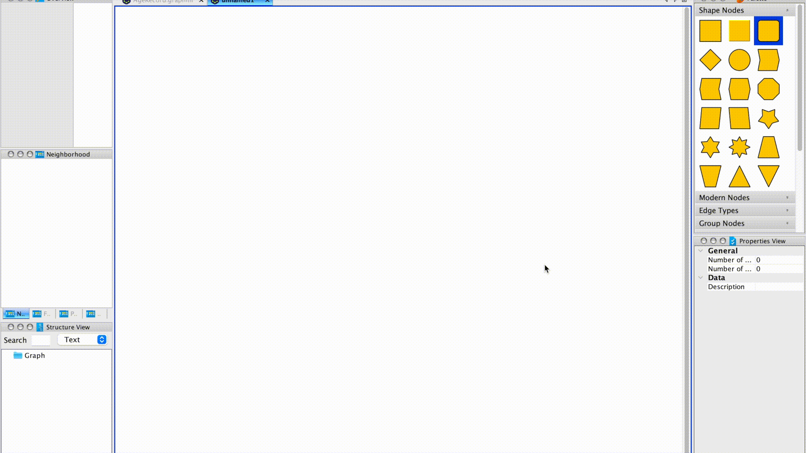
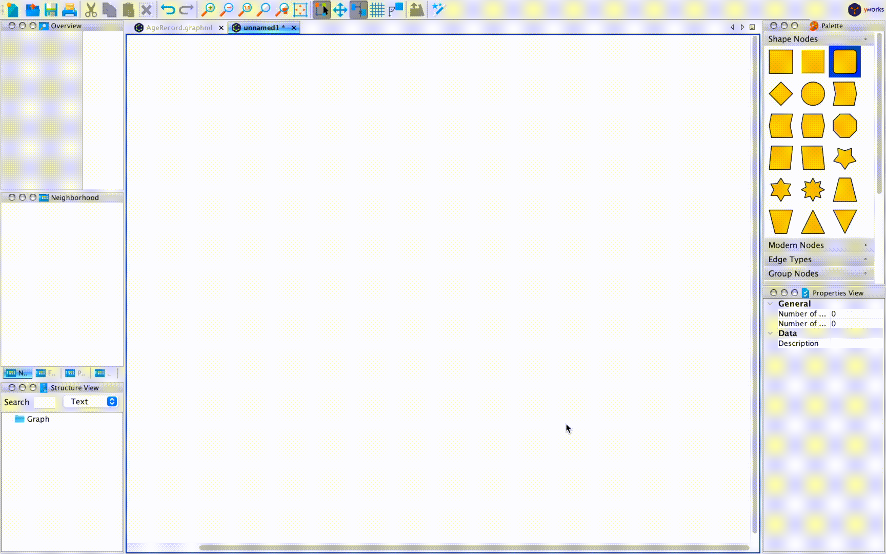
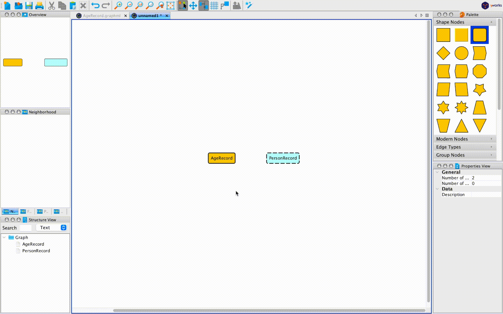

# Schema Diagrams

Schema diagrams serve as graphical representations of ontologies. Due to simplicity being a desirable characteristic of them to facilitate ease of viewing, however, they can be incomplete and ambiguous, lacking the stricter semantics established through the use of axioms. Nonetheless, they provide an easily understandable means of introducing the higher-level concepts of an ontology.

We use yEd to construct these schema diagrams. In the remainder of this section, we provide a tutorial on the construction of schema diagrams using yEd and discuss the visual standards to be adhered to during this process. The `AgeRecord` diagram, depicted below, illustrates a simple schema diagram with many syntactic components that are detailed below.

## Node Types

For all nodes, the size is not set but allowed to automatically adjust as needed depending on the size of it label.

### Class

A class is illustrated via a `Rounded Rectangle` node with a solid frame (`Line Type` set to the second solid frame option) and orange (#ffcc00) `Fill Color`. The label for this node is formatted in PascalCase.

#### Format Summary

- Shape Node: Rounded Rectangle
- Line Type: 2
- Fill Color: Orange (#ffcc00)

### Module

A module is a single node that indicates a level of hidden complexity. That is, there is a complex model that would actually take the place of the single node but is not fully depicted to emphasize only what is essential to the diagram currently being viewed. This full model would be depicted in its entirety elsewhere. A module is illustrated via a `Rounded Rectangle` node with a dashed frame (`Line Type` set to the second dashed frame option) and blue (#ccffff) `Fill Color`. The label for this node is formatted in PascalCase.

#### Format Summary

- Shape Node: Rounded Rectangle
- Line Type: 2
- Fill Color: Blue (#ccffff)

The `PersonRecord` module is expanded below as a sub-module of `AgentRecord`.

### Controlled Vocabulary

A controlled vocabulary is a set of pre-defined URIs with a specific meaning that is documented externally. Each instance of a controlled vocabulary is of the type specified by it (e.g. each instance in `AgeCategory.txt` is of type `AgeCategory`). A controlled vocabulary is illustrated via a `Rounded Rectangle` node with a dashed frame (`Line Type` set to the second dashed frame option) and purple (#cc99ff) `Fill Color`. The label for this node is formatted in PascalCase.

#### Format Summary

- Shape Node: Rounded Rectangle
- Line Type: 9
- Fill Color: Purple (#cc99ff)

### Datatype

A datatype node represents one of the concrete datatypes allowed in OWL. It is illustrated via an `Ellipse` node with a solid frame (`Line Type` set to the second solid frame option) and yellow (#ffff99) `Fill Color`. The label for this node is formatted as dictated by OWL. Protégé is a useful tool for viewing datatypes in addition to providing other capabilities.

#### Format Summary

- Shape Node: Ellipse
- Line Type: 2
- Fill Color: Yellow (#ffff99)

## Edge Types

All edges are given "Smooth Bends" (toggle at the very bottom in the "Bends" section when an arrow is clicked).

### Subclass

A subclass relationship is illustrated via an arrow with a white head (`Target Arrow` set to the fourth option) and no label.

#### Format Summary

- Target Arrow: 4
- Smooth Bends: Enabled

### Data Property or Object Property

A data property or object property (distinguished from one another based on the target of an edge) is illustrated via an arrow with a solid tip (`Target Arrow` set to the second option) and a label. The text for edge labels is formatted in camelCase. The `Background` for edge labels is adjusted to be white (#ffffff) or another color to match the background (this is especially common when `Group Nodes` are used).

#### Format Summary

- Target Arrow: 2
- Smooth Bends: Enabled
- Edge Label Background: White (#ffffff)

The `hasAgeValue` relationship acts as a data property in this diagram.

The `hasAgeCategory` relationship acts as an object property in this diagram.

## References

[1] [yEd](https://www.yworks.com/products/yed)  
[2] [Protégé](https://protege.stanford.edu)  
[3] [The Enslaved Ontology 2.0: People of the Historic Slave Trade](https://docs.enslaved.org/ontology/v2/Enslaved_Documentation_V2_0-2.pdf)  
[4] [Modular Ontology Modeling](https://www.semantic-web-journal.net/system/files/swj2806.pdf)
