# Protégé

## Prerequisites

- [Knowledge Graph](../01-graphs/01-graphs.md#directed-graph): A structured representation of entities and relationships using triples ( subject - predicate - object)
- [Axiom](../02-modeling-fundamentals/03-Axioms.md): A constraint on data that governs the relationships of things.

Protégé is a free, open-source software platform used for creating and managing ontologies. It allows users to define classes (concepts), properties (attributes and relationships), and individuals (instances) along with constraints on data (axioms). By supporting standards like OWL and [RDF](sparql.md), Protégé can easily be added to a pipeline consisting of other tools.

When Protégé is first opened, an `Ontology IRI` can be defined in the `Active ontology` window as shown below to act as a unique ID for the ontology and other contained items:

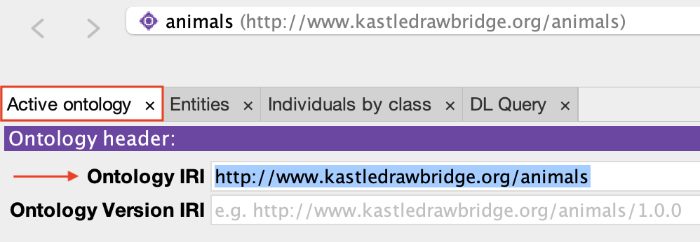

## Classes

A class represents a general concept or category and can be defined by navigating to the `Classes` tab (`Entities` -> `Classes`), selecting one of the already existing classes, and clicking the `Add subclass` button in the `Class hierarchy` box. Note that every class is a subclass of `owl:Thing`, which is automatically provided by Protégé whenever a new ontology is created. In addition, rather than adding a class as a subclass of another class, one can be added at the same level as another class by selecting it and clicking the `Add sibling class` button instead. If a mistake is made, a class can be deleted by selecting it and clicking the `Delete selected classes` button.

##### Class Creation Summary

- Go to `Entities` -> `Classes`
- Select one of the already existing classes
- Click the `Add subclass` button

In the end, a hierarchy like the one shown below should exist. In this example, the class `Animal` is defined as a superclass of `Bird` and `Mammal`. `Mammal` is then defined as a superclass of `Mouse`, `Cat`, and `Dog`.

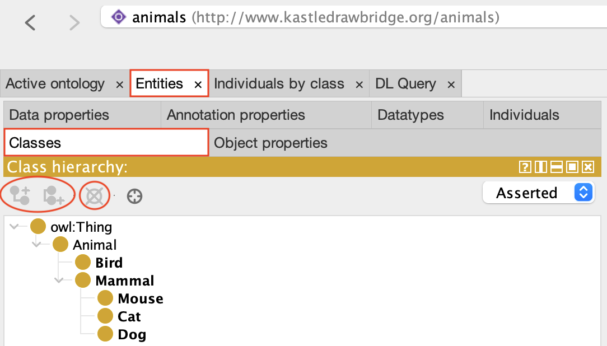

### Individuals

An individual (also called an instance) is a specific example of class and can be defined by navigating to the `Individuals` tab (`Entities` -> `Individuals`) and clicking the `Add individual` button in the `Individuals` box (left side). If a mistake is made, a class can be deleted by selecting it and clicking the `Delete individual` button. Once it has been created, it can be assigned a class by selecting it and clicking the `+` symbol next to `Types` in the `Description` box (lower center).

##### Individual Creation Summary

- Go to `Entities` -> `Individuals`
- Click the `Add individual` button
- Assign it a class via the `Types` section

In the end, a layout similar to the one below should exist. In this example, the individuals `Cat1`, `Cat2`, `Dog`, and `Mouse1` are defined. `Cat1` is then set to be of type `Cat`.

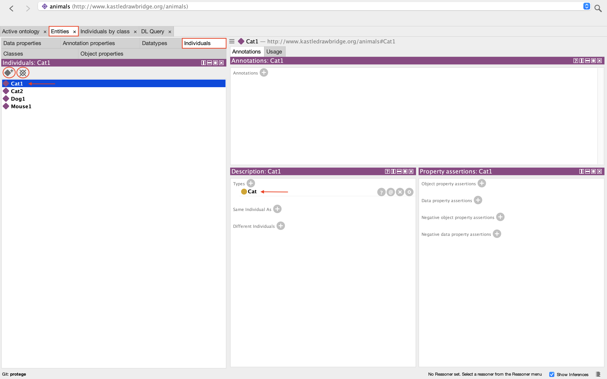

**Note**: Adding a class as a type to an individual will also add that individual as an instance of that class, as shown below in the `Description` box (lower right) of the `Classes` tab: In this example, `Cat1` and `Cat2` are shown to be instances of `Cat`.

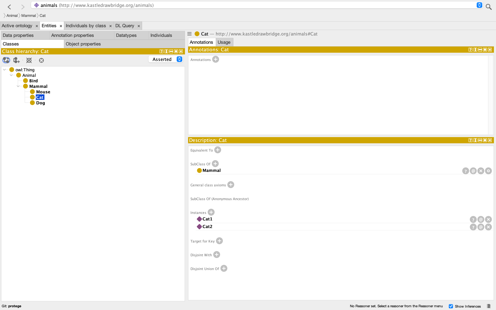

## Properties

Properties define relationships between classes and individuals. There are two types: object properties and data properties.

### Object Properties

An object property describes a relationship between individuals and can be defined by navigating to the `Object properties` tab (`Entities` -> `Object properties`), selecting one of the already existing object properties, and clicking the `Add sub property` button in the `Object property hierarchy` box. Note that every object property is a subproperty of `owl:topObjectProperty`, which is automatically provided by Protégé whenever a new ontology is created. In addition, rather than adding an object property as a subproperty of another object property, one can be added at the same level as another object property by selecting it and clicking the `Add sibling property` button instead. If a mistake is made, an object property can be deleted by selecting it and clicking the `Delete selected properties` button.

##### Object Property Creation Summary

- Go to `Entities` -> `Object properties`
- Select one of the already existing object properties
- Click the `Add sub property` button

In the end, a hierarchy like the one shown below should exist. In this example, the object properties `hasFriend` and `chases` are defined.

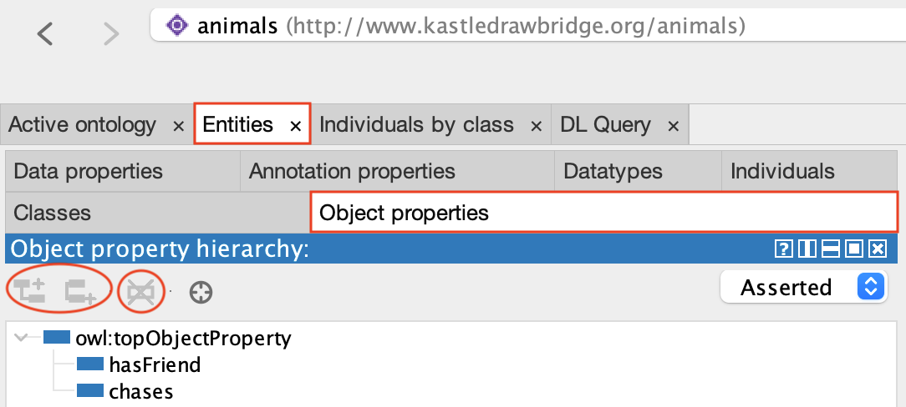

Once object properties have been defined, relationships between individuals can be asserted by again navigating to the `Individuals` tab and clicking the `+` symbol next to `Object property assertions` in the `Property assertions` box (lower right). Two boxes will appear: one to be filled with an object property name and the other to be filled with an individual name.

##### Object Property Assignment Summary

- Go to `Entities` -> `Individuals`
- Select one of the already existing individuals
- Assign it an object property and corresponding individual via the `Object property assertions` section

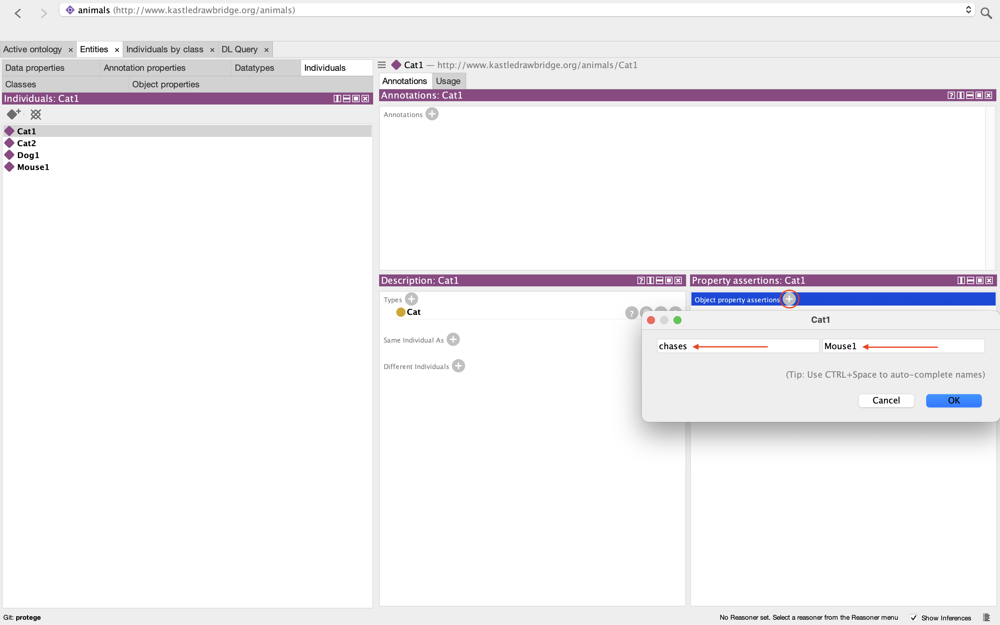

Once these boxes have been filled, the corresponding data should appear under `Object property assertions`. In this example, `Cat1` is asserted to have the object property `chases` with respect to the individual `Mouse1`.

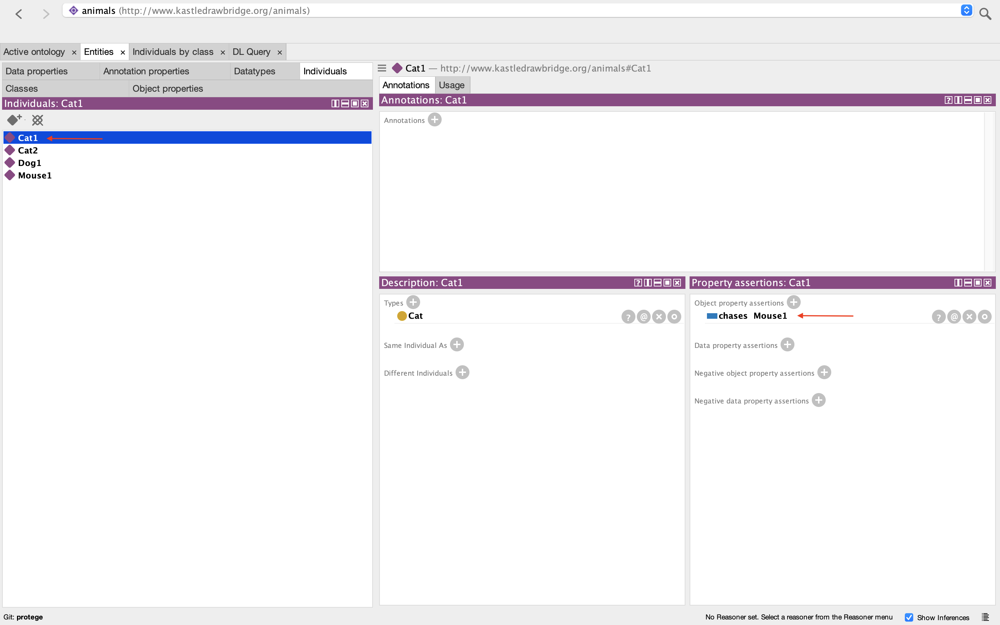

### Data Properties

A data property links an individual to a data value (like strings or numbers) and can be defined by navigating to the `Data properties` tab (`Entities` -> `Data properties`), selecting one of the already existing data properties, and clicking the `Add sub property` button in the `Data property hierarchy` box. Note that every data property is a subproperty of `owl:topDataProperty`, which is automatically provided by Protégé whenever a new ontology is created. In addition, rather than adding a data property as a subproperty of another data property, one can be added at the same level as another data property by selecting it and clicking the `Add sibling property` button instead. If a mistake is made, a data property can be deleted by selecting it and clicking the `Delete selected properties` button.

##### Data Property Creation Summary

- Go to `Entities` -> `Data properties`
- Select one of the already existing data properties
- Click the `Add sub property` button

In the end, a hierarchy like the one shown below should exist. In this example, the data properties `hasAgeInYears` and `hasName` are defined.

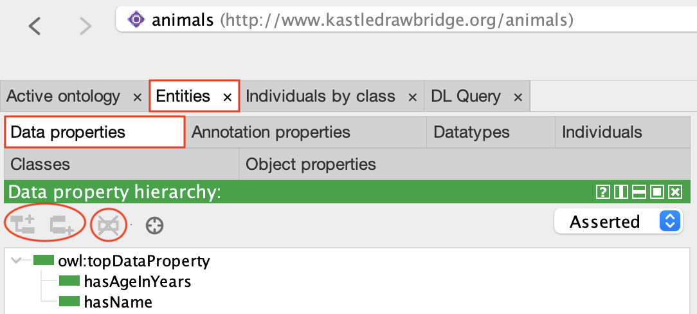

Once data properties have been defined, relationships between individuals and data values can be asserted by again navigating to the `Individuals` tab and clicking the `+` symbol next to `Data property assertions` in the `Property assertions` box (lower right). Three boxes will appear: one for selecting a data property from the hierarchy, one for specifying the value of the data, and one for specifying the datatype.

##### Object Property Assignment Summary

- Go to `Entities` -> `Individuals`
- Select one of the already existing individuals
- Assign it a data property and corresponding individual via the `Data property assertions` section

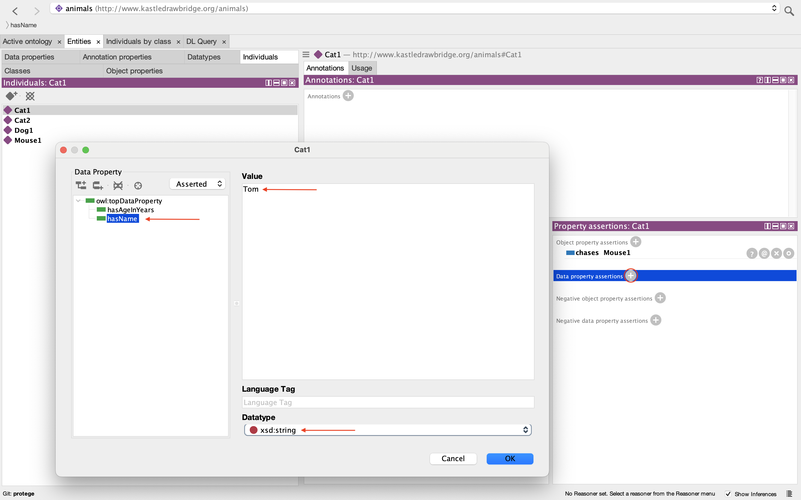

Once these boxes have been filled, the corresponding data should appear under `Data property assertions`. In this example, `Cat1` is asserted to have the data property `hasName` with respect to the string `"Tom"`.

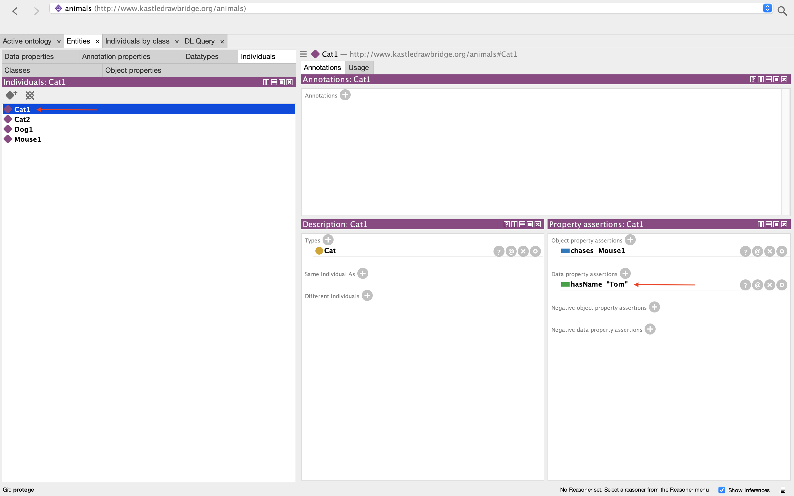

## Datatypes

A datatype, as discussed briefly above, specifies the kind of literal value a data property can hold. While new datatypes can be defined by navigating to the `Datatypes` tab (`Entities` -> `Datatypes`) and clicking the `Add datatype` button (or deleted by clicking the `Delete datatype` button) in the `Datatypes` box, several have been predefined and are ready to use from the start. These predefined datatypes are shown below:

##### Datatype Creation Summary

- Go to `Entities` -> `Datatypes`
- Click the `Add datatype` button

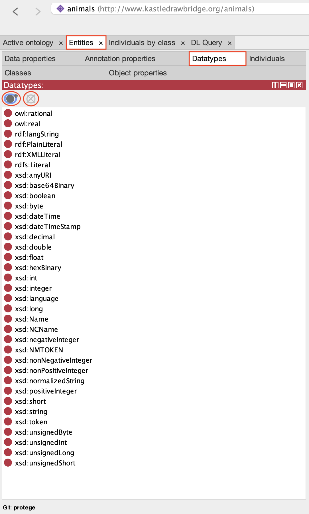

## Axioms

An axiom, as defined in the [Prerequisites](#prerequisites), can be defined between classes by navigating to the `Classes` tab, selecting one of the already existing classes, and clicking the `General class axioms` button in the `Description` box (lower right). The axioms can then be entered (one per line) in the box that appears. Note that special keywords will appear highlighted.

##### Axiom Definition Summary

- Go to `Entities` -> `Classes`
- Select one of the already existing classes
- Assign it an axiom via the `General class axioms` section

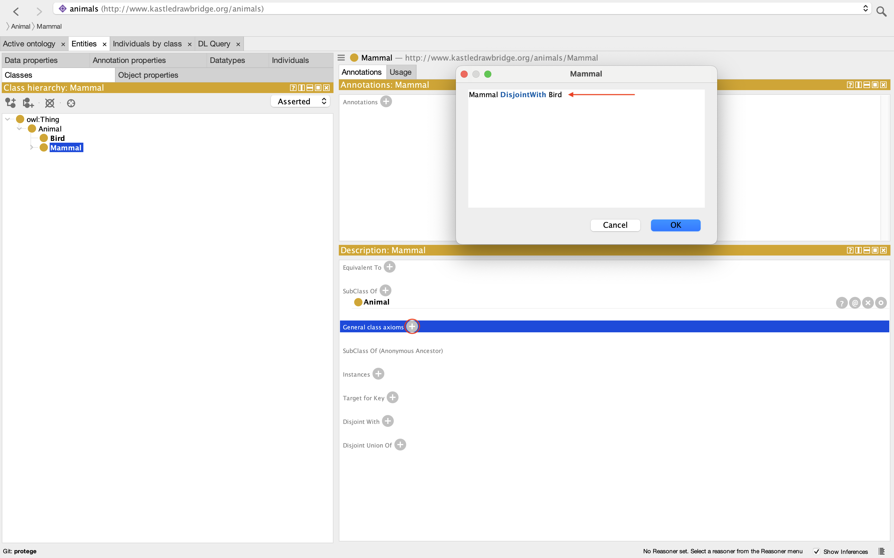

Once this box have been filled, the corresponding data should appear under `General class axioms` or, as in this case, under `Disjoint With` due the assertion of a special axiom. In this example, the class `Mammal` is asserted to be disjoint with the class `Bird`.

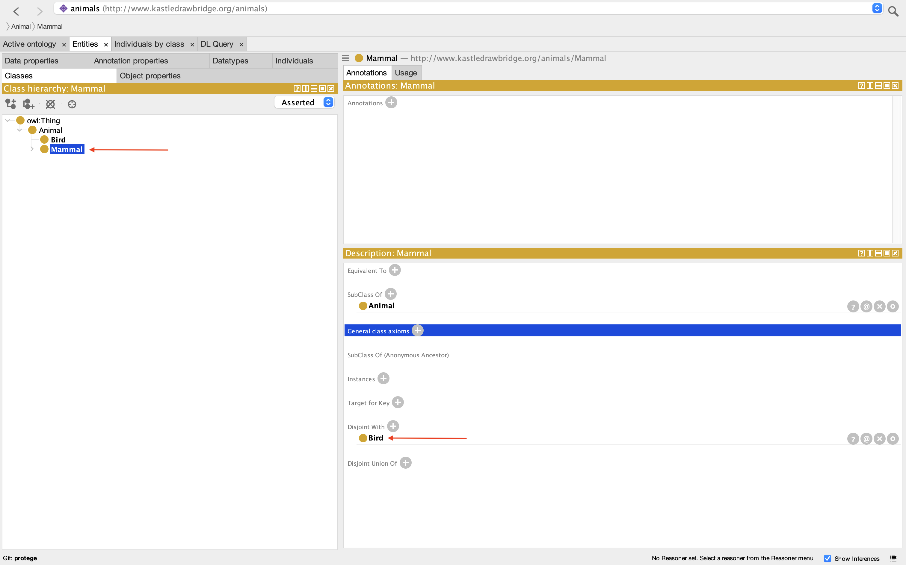

## Outputs

When the ontology is complete, it can be saved in one of the formats shown below. If using Apache Jena Fuseki during the Materialization phase, it is recommended to use `Turtle Syntax`. The complete ontology portrayed in this example is the [AnimalExample.ttl](../Supplementary-material/AnimalExample.ttl) file.

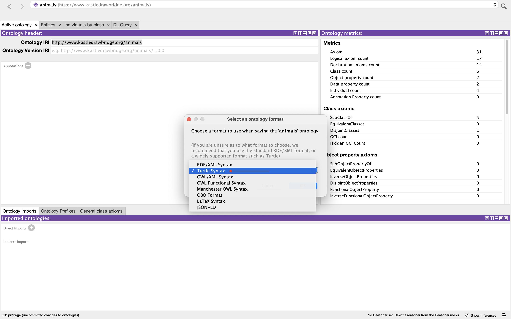

## References

[1] [Protégé](https://protege.stanford.edu/)
