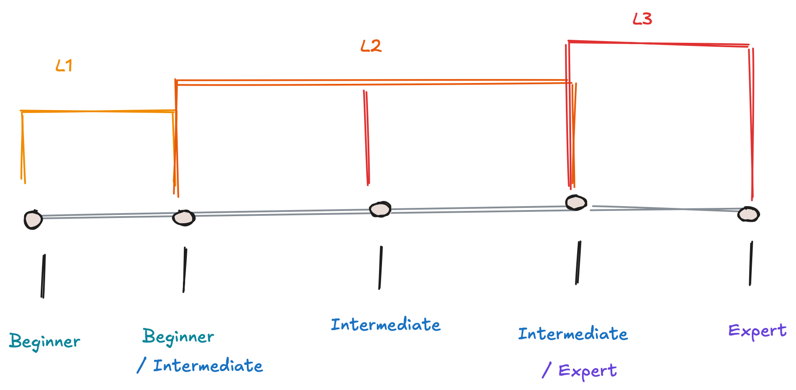

Personas are custom-made for the candidate audience of our educational platform; Drawbridge. They are divided into levels that reflect the audience’s knowledge and experience and of course end goal. The visualization below shows how learners are categorized from Beginner through Intermediate to Expert.

# L1

## Begginer

### THE EVAN

<table>
<tr>
<td style="width:30%; vertical-align:top; border:1px solid #ccc; padding:10px;">

****

**Name:** Evan Brown
**Archetype:** The Evan 
**Status:**  Biomedical Engineering Master's Student

</td>

<td style="width:70%; vertical-align:top; padding:10px;">

I am a second-year graduate student pursuing my thesis in biomedical engineering. I am a  GTA for a biomaterials lab this semester, and I am currently working on 3 other projects with various colleagues. My domain of research is in oncology with a focus on precision medicine, where I believe that there is potential for the use of an ontology! I currently have disparate patient data with which I can make a holistic model, but i am not sure how to integrate ontology into my research. I have no background in computer science, with only a little coding experience. I would need to learn the fundamentals of knowledge graph construction and the practices that go into creating a good ontology.  I would prefer to learn about ontologies on my own time without the need to enroll in a course, I have a busy schedule so I need the delivery to be flexible. I enjoy learning thorugh visually methods rather than solely verbal delivery, with in-depth working examples.  

### Background & Needs

Evans' background in ontology is minimal, meaning that he needs a learning path that will start him at the fundamentals and walk with him through the entire construction process. 

### Learning Path

This persona would benefit from the following learning path:

- [Data Types and Variables](../modules/foundation/01-data-types/data-types-and-variables.md)
- [Conditionals](../modules/foundation/02-conditionals-and-loops/conditionals.md)
- [Loops](../modules/foundation/02-conditionals-and-loops/loops.md)
- [Data Structures](../modules/foundation/03-data-structures/data-structures.md)
- [File Input/ Output](../modules/foundation/04-file-io/file-io.md)
- [Exception Handling](../modules/foundation/05-exception-handling/exception-handling.md)
- [Graphs](../modules/knowledge-graphs/01-graphs/01-graphs.md)
- [Graphs with example](../modules/knowledge-graphs/01-graphs/02-graphs-ttl.md)
- [Modeling Fundamentals](../modules/knowledge-graphs/02-modeling-fundamentals/01-modeling-fundamentals.md)
- [Ontology](../modules/knowledge-graphs/02-modeling-fundamentals/02-ontology.md)
- [Protege](link insert)
- [Axioms](../modules/knowledge-graphs/02-modeling-fundamentals/03-Axioms.md)
- [Competency Questions](../modules/knowledge-graphs/02-modeling-fundamentals/04-Competency-Question.md)
- [Key Notios](../modules/knowledge-graphs/02-modeling-fundamentals/05-key-notions.md)
- [Modeling Technologies](../modules/knowledge-graphs/03-modeling-technologies/01-modeling-technologies.md)
- [Schema Diagrams](../modules/knowledge-graphs/03-modeling-technologies/02-schema-diagrams.md)
- [Materilization](link insert)
- [SPARQL](../modules/knowledge-graphs/03-modeling-technologies/03-sparql.md)
- [SPARQL Tutorial](../modules/knowledge-graphs/03-modeling-technologies/04-sparql-tutorial.md)
- [Querying Methods](../modules/knowledge-graphs/03-modeling-technologies/05-querying-methods.md)

### Outcome

This learning path qould provide Evan with the necessary insights that he can use to develop the ontology he would need for his research. 

</td>
</tr>
</table>

-----
# L2

## Beginner Intermediate

### THE RACHEL

<table>
<tr>
<td style="width:30%; vertical-align:top; border:1px solid #ccc; padding:10px;">

****

**Name:** Rachel Jackson
**Archetype:** The Rachel
**Status:**  Ph.D Student

</td>

<td style="width:70%; vertical-align:top; padding:10px;">

I am a Ph.D student in my first year of graduate school as a computer science major. During my master’s, I was introduced to ontologies via a collaboration with another student. I am working on my dissertation and realize that I could utilize an ontology for my research.  Since most of my Ontology knowledge was gained by working collaboratively with another student, my understanding and background knowledge are a bit unorganized and unclear. I have some background in descriptive logic, and I have proficient coding abilities. I would like to explore how KGs are constructed and the tools that are used to do so. While I do have the time to take a class and learn these things, I would much prefer something more flexible so that I can stay on track with my overall dissertation research. Because of my unorganized information about ontologies, I would like to get a detailed walkthrough on how ontologies are created, definitions, tools, and evaluation metrics that go into an ontology. 

### Background & Needs

Rachels background in ontology is unorganized and missing key terms and the fundamental building blocks of ontology.  She has background in coding meaning she can skip the foundations and dive directly into the material she needs the most. 

### Learning Path

This persona would benefit from the following learning path:

- [Graphs](../modules/knowledge-graphs/01-graphs/01-graphs.md)
- [Graphs with example](../modules/knowledge-graphs/01-graphs/02-graphs-ttl.md)
- [Modeling Fundamentals](../modules/knowledge-graphs/02-modeling-fundamentals/01-modeling-fundamentals.md)
- [Ontology](../modules/knowledge-graphs/02-modeling-fundamentals/02-ontology.md)
- [Protege](link insert)
- [Axioms](../modules/knowledge-graphs/02-modeling-fundamentals/03-Axioms.md)
- [Competency Questions](../modules/knowledge-graphs/02-modeling-fundamentals/04-Competency-Question.md)
- [Key Notions](../modules/knowledge-graphs/02-modeling-fundamentals/05-key-notions.md)
- [Modeling Technologies](../modules/knowledge-graphs/03-modeling-technologies/01-modeling-technologies.md)
- [Materilization](link insert)
- [SPARQL](../modules/knowledge-graphs/03-modeling-technologies/03-sparql.md)
- [SPARQL Tutorial](../modules/knowledge-graphs/03-modeling-technologies/04-sparql-tutorial.md)
- [Querying Methods](../modules/knowledge-graphs/03-modeling-technologies/05-querying-methods.md)

### Outcome

This learning path qould provide Rachel with the necessary insights that she can use to finish her dissertation with success. 

</td>
</tr>
</table>

------------------

## Intermediate

### THE JOE

<table>
<tr>
<td style="width:30%; vertical-align:top; border:1px solid #ccc; padding:10px;">

****

**Name:** Joe Pepper
**Archetype:** The Joe
**Status:**  Graduate Student

</td>

<td style="width:70%; vertical-align:top; padding:10px;">

I am a 2nd year masters student working in an ontology lab in the Computer Science Department. Through my time in the lab, I have been taught many foundational information about ontologies and have a good grasp on what they are and how they can be used. I can create a schema diagram and I know all of the foundational coding required. However, my knowledge and understanding are still at the theoretical level, and i have not been able to apply my knowledge and create an ontology. Currently, the seniors in the lab who have been helping me learn will be out of town to attend various conferences and won’t be able to help me as much. I need a resource that I can refer to that will allow me to learn the modeling standards, creation tools, and evaluation methods, so I can stay up to date on my educational path while they are away. I am working on other projects and would like something that is self-paced but paced so that i can keep on track.

### Background & Needs

Joes background in ontology is above the need for foundational material. He is able to use a schema diagram and is able to visually construct his KG. Joe, however, needs to learn how to develop competence questions and how to implement his ontology to ready it for evaluations.

### Learning Path

This persona would benefit from the following learning path:

- [Protege](link insert)
- [Axioms](../modules/knowledge-graphs/02-modeling-fundamentals/03-Axioms.md)
- [Competency Questions](../modules/knowledge-graphs/02-modeling-fundamentals/04-Competency-Question.md)
- [Key Notions](../modules/knowledge-graphs/02-modeling-fundamentals/05-key-notions.md)
- [Materilization](link insert)
- [SPARQL](../modules/knowledge-graphs/03-modeling-technologies/03-sparql.md)
- [SPARQL Tutorial](../modules/knowledge-graphs/03-modeling-technologies/04-sparql-tutorial.md)
- [Querying Methods](../modules/knowledge-graphs/03-modeling-technologies/05-querying-methods.md)

### Outcome

This learning path could provide Joe with the necessary insights that she can use to create an ontology.
</td>
</tr>
</table>

## Intermediate/ Expert

### THE ERIC

<table>
<tr>
<td style="width:30%; vertical-align:top; border:1px solid #ccc; padding:10px;">

****

**Name:** Eric Smith 
**Archetype:** The Eric 
**Status:**  Graduate Research Assistant

</td>

<td style="width:70%; vertical-align:top; padding:10px;">

Eric is a second year Master's student pursuing his thesis in Computer Science. After being in communications with various professors at the Computer Science and Engineering Department he came across professor X which gave him a description about what his Semantic and Knowledge Graph Technologies is all about. Eric had taken an internship at a local research lab where he had to work with other scientists in identifying terms for a dataset containing hardware information. He got familiar with what is a Knowledge Graph and what is an Ontology since he was actively working with identifying entities and relationships of the dataset. He also took Professors X Logic course last semester so he is familiar with Predicate and Description logic along with Manchester Syntax. Professor X explained that an option for this thesis would be expanding on that work he did in his intership  but that we would have to follow the steps the lab usually takes, along with materializing and evaluating the ontology he will end up building.

### Background & Needs

Eric's learning path consists of the whole vizualisation, constructing and validation process. He has to learn all the tools the lab uses when it comes to Knowledge Graph construction and validation.

### Learning Path

This persona would benefit from the following learning path:

- [Axioms](../modules/knowledge-graphs/02-modeling-fundamentals/03-Axioms.md)
- [Competency Questions](../modules/knowledge-graphs/02-modeling-fundamentals/04-Competency-Question.md)
- [Key Notions](../modules/knowledge-graphs/02-modeling-fundamentals/05-key-notions.md)
- [SPARQL](../modules/knowledge-graphs/03-modeling-technologies/03-sparql.md)
- [SPARQL Tutorial](../modules/knowledge-graphs/03-modeling-technologies/04-sparql-tutorial.md)
- [Querying Methods](../modules/knowledge-graphs/03-modeling-technologies/05-querying-methods.md)

### Outcome

This learning path would provide Eric with the necessary insights that they can use to complete his thesis project.

</td>
</tr>
</table>

-----

# L3

## Expert

### THE PASCAL

<table>
<tr>
<td style="width:30%; vertical-align:top; border:1px solid #ccc; padding:10px;">

****

**Name:** Pascal Walter
**Archetype:** The Pascal
**Status:** Associate Professor

</td>

<td style="width:70%; vertical-align:top; padding:10px;">

Pascal is an associate professor in the Computer Science department of X university. He recently had a successfull research proposal with three other universities regarding collaborating on an ontology/ and knowledge graph of a specific domain along with a natural language engine that queries it and is interactive. All of the researchers need to settle with a common language they will be using along with what ontology engineering methodology they will use. All of the researchers except Pascal have been using MoMo while he uses BFO. He has to be able to fully comprehend that process while also guiding his students that are part of the grant and will be working on it as well. He needs to go through all the stages of Modular Ontology Modeling along with the tools that are most commonly used. 

### Background & Needs

Pascal's learning path consists of learning how to vizualise the graph through yEd using Ontology Design Patterns (odp's) and then materialize it using the rdflib code example, finally validate it using SPARQL/ SHACL. 

### Learning Path
This persona would benefit from the following learning path:

- [Competency Questions](../modules/knowledge-graphs/02-modeling-fundamentals/04-Competency-Question.md)
- [Key Notions](../modules/knowledge-graphs/02-modeling-fundamentals/05-key-notions.md)
- [SPARQL](../modules/knowledge-graphs/03-modeling-technologies/03-sparql.md)
- [SPARQL Tutorial](../modules/knowledge-graphs/03-modeling-technologies/04-sparql-tutorial.md)
- [Querying Methods](../modules/knowledge-graphs/03-modeling-technologies/05-querying-methods.md)

### Outcome

This learning path would provide Pascal with the necessary insights to collaborate with the other researchers and to also onboard his students.

</td>
</tr>
</table>

